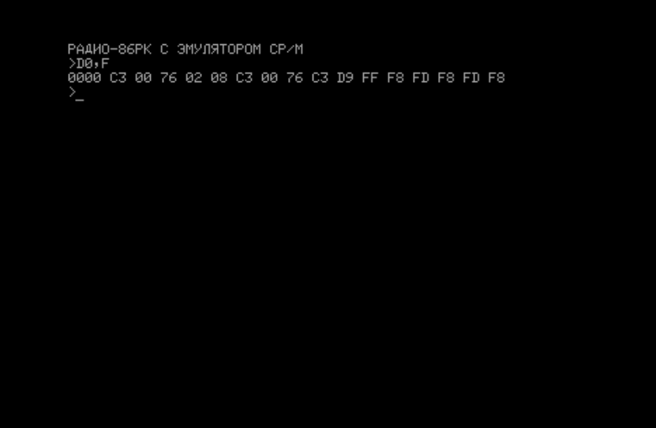

#  МОНИТОР для Радио-86РК для КР580, совместимый с Орион-128, поддержкой VT-52
## ОБЩИЕ СВЕДЕНИЯ

Начало появления данного МОНИТОРа: https://ruecm.forum2x2.ru/t1112-topic

- Звук по умолчанию на INTE, но может быть переопределен.
- В CCP принудительно включается ЛАТ-регистр.
- Удалена директива X
- Директива G теперь не имеет второго параметра -
стоп точки. Зато теперь введён возврат из запуска по G по RET. И можно
передавать два параметра (второй и третий, они передаются в DE и BC).
- Директива D и L теперь одинаковые.
- Все (имеющие смысл) точки входа МОНИТОРа Орион-128.
- Поддержка VT-52 с некоторыми расширениями GEOS/TOS (может быть переопределен) и ограничениями.
- Возможность переопределения п/п работы с консолью и принтером

Не поддерживается часть эмуляции VT-52:
- Удержание экрана (VT-52)
- Поддержка кейпада (VT-52)
- Управление принтером (VT-52)
- Управление цветом (GDOS/TOS)
- Очистка до начала экрана (GDOS/TOS)
- Инверсия символов (GDOS/TOS)

Если удастся еще оптимизировать по размеру, то, по убыванию приоритета, реализую:
- Управление принтером (VT-52)
- Удержание экрана (VT-52)
- Очистка до начала экрана (GDOS/TOS)

Что, может быть, но маловероятно, будет поддержано (для цветных РК-86):
- Управление цветом (GDOS/TOS)
- Инверсия символов (GDOS/TOS)

Что не будет поддержано никогда (из-за аппаратуры):
- Поддержка кейпада (VT-52)

## Системные требования:

- Стандартный журнальный вариант "Радио-86РК"
- Стандартый ROM-диск на 32Кб (для поддержки CP/M)

## Текущие варианты МОНИТОРа:

- МОНИТОР 1.20 16Кб Клавиатура РК-86 + ROM-диск 32Кб
- МОНИТОР 1.20 32Кб Клавиатура РК-86 + ROM-диск 32Кб

## Дистрибутивы

Образы для эмуляторов Bashkiria-2M и EMU80.

## Документация

- [Руководство пользователя по МОНИТОРу](docs/USER.md)
- [Руководство программиста по МОНИТОРу](docs/README.md)
- [Руководство пользователя DECscope VT-5x](docs/EK-VT5X-OP-001_DECscope_Users_Manual_Mar77.pdf)

## Проверка управляющих команд и esc-последовательностей

- УС-G Должен прозвучать звуковой сигнал

- АР2 C курсор должен переместиться вправо; повторяйте пока курсор не окажется в центре экрана.
- УС-J курсор должен переместиться вниз на одну строку.
- АР2 A курсор должен переместиться на одну строку вверх.
- УС-H курсор должен переместиться на одну колонку влево.
- УС-I курсор должен переместиться на следующую позицию табулятора.
- АР2 I cursor should move up one line; this performs a downward scroll if the cursor was on the top line.
- АР2 B cursor should move down one line.
- АР2 D cursor should move left one position.

        Type some characters on all 24 lines.
        With cursor on the bottom line, press "УС-M"; check for cursor to move to the leftmost position on that line.
        Press "АР2 K"; check for all characters on the bottom line to be erased.
        Press "АР2 H"; check for cursor to go to the top left of screen.
        Press "АР2 J"; check for all characters on the screen to be erased.

### Идентификация терминала

- АР2 Z проверка идентификации терминала. При нажатии должен вывести символ "K" (VT-52 без принтера и копира).

### Режим удержания экрана (не реализован)

    Place cursor on bottom line.
    Press "ESC ["; enters Hold-Screen mode.
    Press "LF".
    Type "VT52"; characters should not appear on the screen.
    Press "SCROLL"; the message "VT52" should now appear on the screen.
    Press "ESC \"; exits Hold-Screen mode.
    Press "LF"; check for message to scroll up.

### Прямая адресация курсора

- Press "АР2 H"; cursor should move to the first character position in the first line.
- Press "АР2 Y" "7" "o"; cursor should move to the last character position on the last line.
- Press "АР2 Y" "7" "SPACE"; cursor should move to the first character position on the last line.
- Press "АР2 Y" "SPACE" "o"; cursor should move to the last character position on the first line.
- Press "АР2 Y" "SPACE" "SPACE"; cursor should move back to the first character position on the first line.
