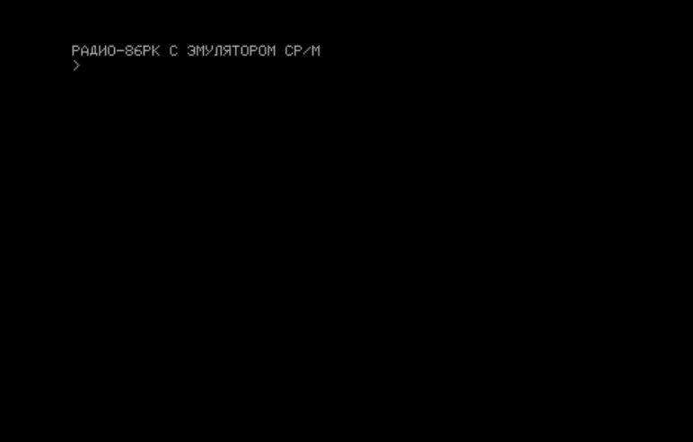

#  МОНИТОР для Радио-86РК для КР580, совместимый с Орион-128, поддержкой VT-52 и эмулятором CP/M
## ОБЩИЕ СВЕДЕНИЯ


https://ruecm.forum2x2.ru/t1112-topic
 
Звук только на INTE

В CCP принудительно включается ЛАТ-регистр.
 
Удалена директива X. Директива G теперь не имеет второго параметра -
стоп точки. Зато теперь введён возврат из запуска по G по RET. И можно
передавать два параметра (второй и третий, они передаются в DE и BC).

Системные требования:

- Стандартный журнальный вариант "Радио-86РК"
- Минимум стандартый ROM-диск на 32Кб (для МОНИТОР-2.00)

Текущие варианты МОНИТОРа:

- МОНИТОР 1.20 16Кб
- МОНИТОР 1.20 32Кб
- МОНИТОР 2.00 16Кб+ROM-диск 32Кб
- МОНИТОР 2.00 32Кб+ROM-диск 32Кб

## ОБЗОР ВЕРСИЙ МОНИТОРов

Для "Радио-86РК" существует несколько МОНИТОРов, в той или иной степени
совместимых между собой. Базовая версия МОНИТОРа опубликована в журнале [Радио 1986 год	№8 и №9].
Назовем его МОНИТОР-1.00. Он существет в двух вариантах 16Кб и 32Кб.

Позже были предложены модифицированные версии МОНИТОРов в журнале Радио.
Все они имеют отличия в основном только в интерактивной части. Назовем их МОНИТОР-1.0x

- МОНИТОР-1.01 под видеоконтроллер на рассыпухе [Радио 1987 год №5 и №6]
- МОНИТОР-1.02 с поддержкой печати [Радио 1988 год №10 и №11]
- МОНИТОР-1.03 с ROM-диск и директивой U (взамен X) [Радио 1991 год №10]
- МОНИТОР-1.04 с клавиатурой МС7007 [Радио 1991 год №12]
- МОНИТОР-1.05 с директивой W (поиск слов) [Радио 1997 год №3]

- МОНИТОР-М/80К для "Микро-80", совместимый с "Радио-86РК" [Радио 1989 год №11]

Данный МОНИТОР является оптимизированной и расширенной версией МОНИТОРа,
включающего в себя поддержку VT-52 и ряда расширений, включая совместимость
по стандартным точкам входа с МОНИТОР-2 "Орион-128" с некоторыми исключениями,
а также эмулятор CP/M.

Данный МОНИТОР представлен несколькими вариантами, расчитанными под разный набор
аппаратного обеспечения "Радио-86РК". От минимальной конфигурации с ОЗУ 16кб,
до Радио86-РК с 32Кб, ROM-диском и РК-НГМД.

## ВВОД ДИРЕКТИВ И АНАЛИЗ РЕЗУЛЬТАТОВ

После запуска МОНИТОРа экран очищается, в левом верхнем углу
появляется надпись "РАДИО-86РК" или "РАДИО-86РК С ЭМУЛЯТОРОМ CP/M",
а под ней - стрелка >, уведомляющая пользователя о том, что МОНИТОР
готов к вводу очередной директивы.



Неверно набранные символы стирают нажатием на клавишу "ЗБ" ("Забой").
"<-" ("Курсор влево"), в отличие от оригинального МОНИТОРа, просто
смещает курсор влево. Для выполнения директивы нажимают на клавишу
возврата каретки "ВК". Если директива задана правильно, то начнется ее
выполнение, если нет, - на экране появится знак вопроса - признак того,
что МОНИТОР "не понимает" вашу директиву или произошло переполнение буфера
ввода.
 
Выполнение директив О, L, S может быть прервано. Для этого, удерживая
клавишу "УС", надо нажать еще и на "С"; выполнение директивы прервется,
и МОНИТОР будет готов выполнять следующую (здесь и далее для директив
используется латинский регистр).
 
Имена всех директив состоят из одной латинской буквы, непосредственно за
которой могут следовать не более трех параметров, представляющих собой
шестнадцатеричные числа. Один параметр от другого отделяют запятой или
пробелом. Их ставят и в тех случаях, когда один из параметров (в том
числе и первый) отсутствует.
 
## ДИРЕКТИВЫ РАБОТЫ С ПАМЯТЬЮ

Содержимое области памяти может быть выведено на экран дисплея либо в
виде шестнадцатеричных чисел (директива D), либо в виде алфавитно-
цифровых символов, соответствующих этим кодам (директива L). Если
при выполнении последней встретятся коды, не соответствующие ни одному
алфавитно-цифровому символу, то они отобразятся в виде точек. Содержимое
памяти выводится в виде таблицы из 16 колонок. Слева от каждой строки
указывается шестнадцатеричный адрес первой в строке ячейки. Форматы
этих и других директив приведены в табл. 1. Директива М предназначена
для просмотра и изменения содержимого одной или нескольких ячеек памяти.
После ее ввода на экране высвечивается адрес ячейки и ее содержимое,
курсор останавливается справа от этого значения, и МОНИТОР "ожидает"
ввода с клавиатуры. Если необходимо изменить содержимое ячейки, набирают
новое значение и нажимают клавишу "ВК", если изменений не требуется, ее
нажимают сразу же. При каждом нажатии на клавишу "ВК" значение адреса
автоматически увеличивается на единицу. Выполнение директивы продолжается
до тех пор, пока не будет вводен с клавиатуры код "УС" + "С".
 
 Таблица 1
 ```
 ДИРЕКТИВЫ МОНИТОРА
 ДИРЕКТИВЫ РАБОТЫ С ПАМЯТЬЮ
 D <НАЧАЛЬНЫЙ АДРЕС>,/<КОНЕЧНЫЙ АДРЕC>/
 L <НАЧАЛЬНЫЙ АДРЕС>,/<КОНЕЧНЫЙ АДРЕС>/
 F <НАЧАЛЬНЫЙ АДРЕС>, <КОНЕЧНЫЙ АДРЕС>, <ЗАПИСЫВАЕМЫЙ КОД>
 M <АДРЕС>
 T <НАЧАЛЬНЫЙ АДРЕС>, <КОНЕЧНЫЙ АДРЕС>, <АДРЕС ОБЛАСТИ ПЕРЕСЫЛКИ>
 C <НАЧАЛЬНЫЙ АДРЕС>, <КОНЕЧНЫЙ АДРЕС>, <АДРЕС ОБЛАСТИ СРАВНЕНИЯ>
 S <НАЧАЛЬНЫЙ АДРЕC>, <КОНЕЧНЫЙ АДРЕС>, <ИСКОМЫЙ КОД>
 ДИРЕКТИВЫ ЗАПУСКА И ОТЛАДКИ
 G <АДРЕС ЗАПУСКА>
 ДИРЕКТИВЫ ВВОДА-ВЫВОДА
 O <НАЧАЛЬНЫЙ АДРЕС>,<КОНЕЧНЫЙ АДРЕС>,/<СКОРОСТЬ>/
 I /<СМЕЩЕНИЕ>/,/< СКОРОСТЬ>/
 ДОПОЛНИТЕЛЬНЫЕ ДИРЕКТИВЫ
 R <НАЧАЛЬНЫИ АДРЕС ПЗУ>, <КОНЕЧНЫИ АДРЕС ПЗУ>, <АДРЕС ЗАГРУЗКИ>
 (НАКЛОННЫМИ ЧЕРТАМИ ВЫДЕЛЕНЫ НЕОБЯЗАТЕЛЬНЫЕ ПАРАМЕТРЫ)
 U
 ```

Если во все ячейки области памяти необходимо записать одинаковые коды,
удобно воспользоваться директивой F.
 
Директива T предназначена для копирования (пересылки) содержимого одной
области памяти в другую. Копирование осуществляется побайтно, начиная с
младшего адреса.
 
Для сравнения двух областей памяти необходимо пользоваться директивой C.
Если содержимое соответствующих ячеек памяти не совпадает, на экран
выводится адрес ячейки из первой области, ее содержимое и содержимое
соответствующей ячейки из второй области. МОНИТОР предоставляет
пользователю возможность поиска кода в заданной области памяти
(директива S). При обнаружении искомого кода на экране появляются
адреса ячеек, в которых он был обнаружен.
 
## ДИРЕКТИВЫ ЗАПУСКА

Для запуска программы служит директива G.
Для запуска программы с адреса 075FDh/035FDH служит директива Z.
Эта директива введена для удобства работы с программами, которые
размещаются под “потолком” ОЗУ пользователя, т. е. в верхних
адресах памяти. В таких программах (в конце) по адресу 075FDH/035FDH
должна находиться команда безусловного перехода (JMP) на начало программы.
При этом размер программы не будет влиять на стартовый адрес, а значит,
все подобные программы можно запускать по одному стандартному адресу — 075FDH/035FDH.
 
## ДИРЕКТИВЫ ВВОДА-ВЫВОДА

Первые два параметра директивы вывода на магнитную ленту О задают
область памяти, содержимое которой подлежит выводу, третий -
шестнадцатеричный код, определяющий скорость вывода. Если скорость
не указать, то будет использовано либо значение, заданное в предыдущей
директиве вывода, либо стандартное - 1DH (около 1200 бит/с), записываемое
(при нажатии на кнопку "СБРОС") в рабочую ячейку МОНИТОРа (07630Н) (03630Н)
(использовать константу вывода менее 10H недопустимо!). Рекомендуем
пользоваться стандартной скоростью, так как она выбрана с учетом
использования магнитофона и магнитной ленты невысокого качества.
Кроме того, стандартная скорость облегчит обмен программами. После
завершения вывода, на экране отобразятся начальный и конечный адреса
и четырехзначная контрольная сумма выведенной информации.

Ввод с ленты осуществляется по директиве I, которая может иметь два
параметра. Первым параметром - необязательным - задают смещение. Если
он есть, вводимая информация будет загружена по адресу, являющемуся
суммой указанного в записи на ленте адреса и смещения. Второй параметр
определяет временную задержку при чтении с ленты. Он также может
отсутствовать, но в этом случае будет взята задержка, использовавшаяся
в предыдущей команде ввода (если вы не нажимали на кнопку "СБРОС") или
установленная (по умолчанию) при начальной настройке рабочих ячеек
МОНИТОРа (стандартное значение, записанной по адресу 0362FH - 2АН).
 
После окончания ввода МОНИТОР сообщит начальный и конечный адреса
загрузки и контрольную сумму, подсчитанную при вводе информации.
Если она не совпадет с введенной с ленты, то на следующей строке
будет выведено значение, записанное на ленте. Этот факт
свидетельствует об ошибках при чтении информации с ленты.
 
Прервать программу ввода с магнитной ленты можно либо выключением
магнитофона, либо вводом с клавиатуры кода "УС" + "С".
 
Используемый в РК формат записи на магнитную ленту отличается от
используемого в "Микро-80" только наличием в конце выводимой
информации контрольной суммы, поэтому программы, записанные с
"Радио-86РК", могут быть введены в "Микро-80". При попытке
ввести в РК программу, записанную с "Микро-80", подпрограмма
ввода будет ожидать ввода контрольной суммы. Если не останавливать
магнитофон и <позволить> ей читать начало следующей программы, то
она будет воспринята как контрольная сумма и ввод будет окончен.
Естественно, что такая <контрольная сумма> не совпадет с реальной,
и МОНИТОР <ответит> на эти действия вопросительным знаком,
 
В табл. 1 приведены форматы еще двух директив: R - чтения
информации из ПЗУ, подключаемого к ППА D14, и U - запускающая
программу управления ROM-диском (только для МОНИТОР 2.00). 

## СТАНДАРТНЫЕ ПОДПРОГРАММЫ МОНИТОРа
```
 +-----------------------------+--------+------------------------------+
 !	Назначение		! Адрес  !	Параметры		!
 !				! вызова !				!
 +-----------------------------+--------+------------------------------+
 !  Ввод символа с клавиатуры	! 0F803H ! ВХОДНЫЕ              	!
 !				! 	 ! ВЫХОДНЫЕ			!
 ! 				! 	 ! А - введенный код		!
 +-----------------------------+--------+------------------------------+
 ! Ввод байта с магнитофона	! 0F806Н ! ВХОДНЫЕ			!
 ! 				! 	 ! А=0FFН с поиском синхробайта	!
 ! 				! 	 ! A=08Н без поиска синхробайта	!
 !				! 	 ! ВЫХОДНЫЕ			!
 ! 				! 	 ! А - введенный байт		!
 +-----------------------------+--------+------------------------------+
 ! Вывод символа на экран	! 0F809Н ! ВХОДНЫЕ			!
 ! 				! 	 ! С - выводимый символ		!
 !				! 	 ! ВЫХОДНЫЕ			!
 +-----------------------------+--------+------------------------------+
 ! Запись байта на магнитофон	! 0F80CH ! ВХОДНЫЕ			!
 ! 				! 	 ! С - выводимый байт		!
 !				! 	 ! ВЫХОДНЫЕ			!
 +-----------------------------+--------+------------------------------+
 ! Опрос состояния клавиатуры	! 0F812H ! ВХОДНЫЕ			!
 !				! 	 ! ВЫХОДНЫЕ			!
 ! 				! 	 ! A=00H - не нажата		!
 ! 				! 	 ! A=0FFH - нажата		!
 +-----------------------------+--------+------------------------------+
 ! Распечатка байта на экране	! 0F815H ! ВХОДНЫЕ			!
 ! в шестнадцатеричном виде	! 	 ! А - выводимый код		!
 !				! 	 ! ВЫХОДНЫЕ			!
 +-----------------------------+--------+------------------------------+
 ! Вывод на экран сообщения	! 0F818H ! ВХОДНЫЕ			!
 ! 				! 	 ! HL - адрес начала сообщения	!
 !				! 	 ! ВЫХОДНЫЕ			!
 +-----------------------------+--------+------------------------------+
 ! Ввод кода нажатой клавиши	! 0F81BH ! ВХОДНЫЕ			!
 !				! 	 ! ВЫХОДНЫЕ			!
 ! 				! 	 ! A=0FFH - не нажата		!
 ! 				! 	 ! A=0FEH - РУС/ЛАТ		!
 ! 				! 	 ! ИНАЧЕ - код клавиши		!
 +-----------------------------+--------+------------------------------+
 ! Запрос положения курсора	! 0F81EH ! ВХОДНЫЕ			!
 !				! 	 ! ВЫХОДНЫЕ			!
 ! 				! 	 ! Н - номер строки		!
 ! 				! 	 ! L - номер позиции		!
 +-----------------------------+--------+------------------------------+
 ! Запрос байта из экранного	! 0F821H ! ВХОДНЫЕ			!
 ! буфера			! 	 ! ВЫХОДНЫЕ			!
 ! 				! 	 ! А - код из буфера		!
 +-----------------------------+--------+------------------------------+
 ! Ввод блока с магнитофона	! 0F824H ! ВХОДНЫЕ			!
 ! 				! 	 ! HL - смещение		!
 !				! 	 ! ВЫХОДНЫЕ			!
 ! 				! 	 ! HL - адрес начала		!
 ! 				! 	 ! DE - адрес конца		!
 ! 				! 	 ! ВС - контрольная сумма	!
 +-----------------------------+--------+------------------------------+
 ! Вывод блока на магнитофон	! 0F827Н ! ВХОДНЫЕ			!
 ! 				! 	 ! HL - адрес начала		!
 ! 				! 	 ! DE - адрес конца		!
 ! 				! 	 ! ВС - контрольная сумма	!
 ! 				! 	 ! ВЫХОДНЫЕ			!
 +-----------------------------+--------+------------------------------+
 ! Подсчет контрольной суммы	! 0F82AH ! ВХОДНЫЕ 			!
 ! блока			! 	 ! HL - адрес начала		!
 ! 				! 	 ! DE - адрес конца		!
 ! 				! 	 ! ВЫХОДНЫЕ			!
 !				! 	 ! ВС - контрольная сумма	!
 +-----------------------------+--------+------------------------------+
 ! Запуск индикации на экране	! 0F82DH ! ВХОДНЫЕ			!
 !				!	 ! ВЫХОДНЫЕ			!
 +-----------------------------+--------+------------------------------+
 ! Передача адреса верхней	! 0F830H ! ВХОДНЫЕ			!
 ! границы свободной памяти	! 	 ! ВЫХОДНЫЕ			!
 ! программе пользователя	! 	 ! HL - адрес границы		!
 +-----------------------------+--------+------------------------------+
 ! Установка адреса верхней	! 0F833H ! ВХОДНЫЕ			!
 ! границы свободной памяти 	! 	 ! HL - адрес границы		!
 ! программы пользователя	! 	 ! ВЫХОДНЫЕ			!
 +-----------------------------+--------+------------------------------+
 ! Чтение из ДопОЗУ		! 0F836H ! ВХОДНЫЕ			!
 !				! 	 ! hl - адрес			!
 !				! 	 ! a - номер доп. страницы	!
 !				! 	 ! ВЫХОДНЫЕ			!
 !				! 	 ! c - считанный байт		!
 +-----------------------------+--------+------------------------------+
 ! Запись в ДопОЗУ		! 0F839H ! ВХОДНЫЕ			!
 !				! 	 ! hl - адрес			!
 !				! 	 ! a - номер доп. страницы	!
 !				! 	 ! c - записываемый байт	!
 +-----------------------------+--------+------------------------------+
 ! Установка координат курсора	! 0F83CH ! ВХОДНЫЕ			!
 !				! 	 ! Н - номер строки - Y		!
 !				!	 ! L - номер позиции - X	!
 +-----------------------------+--------+------------------------------+
 ! Подача звукового сигнала	! 0F83FH ! 				!
 +-----------------------------+--------+------------------------------+
```
## НЕСТАНДАРТНЫЕ ПОДПРОГРАММЫ МОНИТОРа

 Данные точки входа не являются документированными в оригинальном МОНИТОРе,
 но часто использовались программным обеспечением, поэтому они поддерживаются
 для совместимости.
```
 +-----------------------------+--------+------------------------------+
 ! Горячая перезагрузка        ! 0F86CH !                              !
 +-----------------------------+--------+------------------------------+
 ! Ввод командной строки       ! 0F8EEH !                              !
 +-----------------------------+--------+------------------------------+
 ! Разбор параметров строки    ! 0F92cH !                              !
 +-----------------------------+--------+------------------------------+
 ! Сравнение HL с DE           ! 0F990H !                              !
 +-----------------------------+--------+------------------------------+
 ! Печать переноса строки      ! 0F9B0H !                              !
 +-----------------------------+--------+------------------------------+
 ! Чтение данных из ROM-диска  ! 0FA68H !                              !
 +-----------------------------+--------+------------------------------+
 ! Инициализация видео         ! 0FACEH !                              !
 +-----------------------------+--------+------------------------------+
 ! Печать HL и пробела с новой ! 0FB78H !                              !
 ! строки                      !        !                              !
 +-----------------------------+--------+------------------------------+
```

## СТАНДАРТНЫЕ ПОДПРОГРАММЫ CP/M BIOS

Начало BIOS можно опреледить командой МОНИТОРа D1,2. Добавив смещение можно
определить адрес точки входа. Данный метод является предпочтительней, чем
прямое ипользование адресов точек входа.

```
 +-----------------------------+--------+------------------------------+
 !	Назначение		!Смещение!	Параметры		!
 +-----------------------------+--------+------------------------------+
 !  Холодный старт		!   -3	 ! ВХОДНЫЕ              	!
 !				! 	 ! ВЫХОДНЫЕ			!
 ! 				! 	 ! А - введенный код		!
 +-----------------------------+--------+------------------------------+
 !  Теплый старт		!   0	 ! ВХОДНЫЕ			!
 !				! 	 ! ВЫХОДНЫЕ			!
 +-----------------------------+--------+------------------------------+
 ! Состояние консоли		!   3	 ! ВХОДНЫЕ			!
 !				! 	 ! ВЫХОДНЫЕ			!
 ! 				! 	 ! A=00H - клавиша не нажата	!
 ! 				! 	 ! A=0FFH - клавиша нажата	!
 +-----------------------------+--------+------------------------------+
 ! Ввод с консоли		!   6	 ! ВХОДНЫЕ			!
 !				! 	 ! ВЫХОДНЫЕ			!
 +-----------------------------+--------+------------------------------+
 ! Вывод на консоль		!   9	 ! ВХОДНЫЕ			!
 !				! 	 ! ВЫХОДНЫЕ			!
 +-----------------------------+--------+------------------------------+
 ! Вывод на принтер		!   12	 ! ВХОДНЫЕ			!
 !				! 	 ! ВЫХОДНЫЕ			!
 +-----------------------------+--------+------------------------------+
 ! Вывод на магнитофон		!   15	 ! ВХОДНЫЕ			!
 !				! 	 ! ВЫХОДНЫЕ			!
 +-----------------------------+--------+------------------------------+
 ! Ввод с магнитофона		!   18	 ! ВХОДНЫЕ			!
 !				! 	 ! ВЫХОДНЫЕ			!
 +-----------------------------+--------+------------------------------+
```

## СТАНДАРТНЫЕ ПОДПРОГРАММЫ CP/M BDOS

- BDOS function 0 (P_TERMCPM) - System Reset
- BDOS function 1 (C_READ) - Console input
- BDOS function 2 (C_WRITE) - Console output
- BDOS function 6 (C_RAWIO) - Direct console I/O
- BDOS function 9 (C_WRITESTR) - Output string
- BDOS function 10 (C_READSTR) - Buffered console input
- BDOS function 11 (C_STAT) - Console status
- BDOS function 12 (S_BDOSVER) - Return version number

## НУЛЕВАЯ СТРАНИЦА

- 00–02 	Code 	Exit program (jumps to the BIOS, and is also used to find BIOS entry points).[1]
- 03 	Byte 	I/O byte, an optional feature allowing device reassignment in CP/M 2.
- 04 	Byte 	Current command processor drive (low 4 bits) and user number (high 4 bits).
- 05–07 	Code 	Jump to CP/M BDOS entry - main system call entry point. This is also the address of the first byte of memory not usable by the program.[1]
- 08–3A 	Code 	8080 restart/interrupt vectors.
- 3B–4F 	Bytes 	Reserved
- 50 	Byte 	The drive from which the program was loaded (CP/M 3)
- 51–52 	Word 	Address of the password for the first FCB (CP/M 3)
- 53 	Byte 	Length of the password for the first FCB (CP/M 3)
- 54–55 	Word 	Address of the password for the second FCB (CP/M 3)
- 56 	Byte 	Length of the password for the second FCB (CP/M 3)
- 57–5B 	Bytes 	Reserved
- 5C–6B 		Default FCB 1
- 6C–7F 		Default FCB 2 (overwritten if FCB 1 is opened)
- 80 	Byte 	Number of characters in command tail.
- 81–FF 	Bytes 	Command tail (everything after the program name). 

## УПРАВЛЯЮЩИЕ КОДЫ ДИСПЛЕЯ

Данная версия МОНИТОРа реализует поддержку управляющих кодов
дисплея, своместимых с терминалом DECscope VT52. В связи с
этим, поведение некоторых управляющих кодов отличается от
оригинальной версии МОНИТОРа.

Управляющие коды, в отличие от остальных, не отображаются в виде
алфавитно-цифрового или псевдографического символа, а вызывают
выполнение какой-либо специфичной функции, связанной с управлением
форматом выводимых на экран сообщений (табл.8).
 
Функция <- (<Курсор влево>) вызывает перемещение курсора на одну
позицию влево. Если курсор находился в самой левой позиции строки,
то его перемещение, в отличие от оригинального МОНИТОРа, не происходит.
 
Функция -> (<Курсор вправо>) перемещает курсор в противоположном
направлении. Переход курсора на другую стоку, в отличие от оригинального
МОНИТОРа, не происходит.
 
Функции - (<Курсор вверх>) и (<Курсор вниз>) вызывают перемещение
курсора на одну строку вверх или вниз соответственно. Если при этом
курсор находился в самой нижней строке экрана, то при выполнении
функции <Курсор вниз> он, в отличие от оригинального МОНИТОРа,
останется на той же строке. Аналогично и с функцией <Курсор вверх>.
 
 Функция <ВК> - <Возврат каретки> (не путать с клавишей) переведет курсор
 в первую позицию той же строки экрана, в которой он и находился. Если
 курсор уже находится в самой левой позиции, его положение не изменится.
 
 Функция <ПС> (<Перевод строки>) действует так же, как и <Курсор вниз>,
 в том случае, если курсор не находится в последней строке экрана, в
 противном случае курсор остается в прежней позиции, и на экране происходят
 следующие изменения: на месте первой строки появляется вторая, на месте
 второй - третья и т. д., последняя строка экрана очищается. Таким образом,
 текст на экране дисплея передвигается на одну строку вверх, вся информация,
 высвечиваемая в первой строке, теряется, а последняя строка освобождается
 для вывода новой строки символов. Данный процесс называется прокруткой
 экрана.
 
 Функция <СТР> (<Стирание экрана>) полностью стирает весь текст на экране
 и устанавливает курсор в нулевую позицию (левый верхний угол).
 
 Функция <\> (<Курсор в начало экрана>) перемещает курсор в левый верхний
 угол экрана. Информация на экране остается неизменной.
 
 Функция "BEL" выдаст звуковой сигнал продолжительностью примерно 0,25 с.

 Функция "TAB" размещает курсор в ближайшей следующей позиции "табулятора".
 Т.е. в позициях 8, 16, 24, 32, 40, 48, 56. Отсчет ведется от 0.

 Функция "ESC" переводит в режим обработки Escape-кодов.

 Код "A" - Курсор вверх

 Код "B" - Курсор вниз

 Код "C" - Курсор вправо

 Код "D" - Курсор влево

 Код "E" - очистка экрана (расширение GDOS/TOS)

 Код "F" -- не используется, зарезервирована для включения алтернативного знакогенератора

 Код "G" -- не используется, зарезервирована для выключения алтернативного знакогенератора

 Код "H" - перемещение курсора в левый верхний угол

 Код "I" - обратный перевод строки. Поведение аналогично переводу строки, но курсор смещается вверх
 и прокрутка вверх

 Код "J" - очистка до конца экрана

 Код "K" - очистка до конца строки

 Код "L" - не используется, вставить строку (нет в описании VT-52)

 Код "M" - не используется, удалить строку (нет в описании VT-52)

 Код "Y" - функция прямой адресации курсора. Чтобы установить курсор
 в требуемую позицию на экране, необходимо выдать на дисплей
 последовательность кодов: 1ВН+59Н+(НОМЕР СТРОКИ+20Н)+(НОМЕР ПОЗИЦИИ + 20H).
 Строки и позиции на экране отсчитываются от 0, причем нулевой строкой
 экрана считается самая верхняя строка, а нулевой позицией - самая левая.

 Код "Z" - не используется, идентификация типа терминала

 Код "[" - не используется, включить удержание экрана

 Код "\" - не используется, отключить удержание экрана

 Код "=" - не используется, Alternate keypad

 Код ">" - не используется, Exit alternate keypad

 Код "<" - не используется, включить/выключить поддержку кодов ANSI (VT100)

 Код "a" - Скрыть курсор (расширение M/80K)

 Код "b" - Показать курсор (расширение M/80K)

 Код "b#" - не используется, Foreground color (расширение GDOS/TOS)

 Код "c#" - не используется, Background color (расширение GDOS/TOS)

 Код "d" - не используется. Очистить экран до левого верхнуго угла экрана (расширение GDOS/TOS)

 Код "e" - Показать курсор (расширение GDOS/TOS)

 Код "f" - Скрыть курсор (расширение GDOS/TOS)

 Код "j" - Запомнить текущую позицию курсора (расширение GDOS/TOS)

 Код "k" - Восстановить запомненную позицию курсора (расширение GDOS/TOS)

 Код "l" - Очистить текущую строку и установить указатель курсора в начало строки (расширение GDOS/TOS)

 Код "o" - Очистить строку от начала строки до текущего положения курсора (расширение GDOS/TOS)

 Код "p" - Не используется, Reverse video (расширение GDOS/TOS)

 Код "q" - Не используется, Normal video (расширение GDOS/TOS)

 Код "v" - Включить автоперенос строки (расширение GDOS/TOS)

 Код "w" - Выключить автоперенос строки (расширение GDOS/TOS)

## ROM-диск

!!!Тут вставить описалово формата ROM-диска. Не забываем, что есть "стандарт" Орион и "стандарт" МОНИТОРа с командой U.

Директива U вызывает программу управления ROM-диском. Данная директива реализована
совместимо с [Радио 1991 год №10].

Программа управление ROM-диском отличается от опубликованной и рассчитана на работу
с ROM-диском, совместимом по формату с Орион-128.

Формат ROM-диска выбран таким образом, чтобы быть совместимым с Орион-128.
В адресах 0000H-07FFH раполагаются части эмулятора BDOS CP/M. Данная область условно
разделена на блоки по 128 байт, которые подгружаются в область обмена ОЗУ.
Блок 0 содержит код защиты от запуска на Орион-128 и код начальной инициализации
CP/M. Блок 1 содержит код перехода на функции BDOS. Остальные блоки содержат
функции CP/M BDOS.

Блок 3 содержит код директив МОНИТОРа

Область с 0800h и выше содержит файлы в том же формате, что и диск ORDOS.

TODO: Вставить описание формата файлов

## Шпаргалка

- Набор тестов для проверки корректности работы подпрограмм
- Добавить дисковые функции CP/M для работы с ROM-диском
- Исправить сведения о константе скорости (07630Н) (03630Н)
- Сделать программу управления ROM-диск совместимой с 16кб версией
