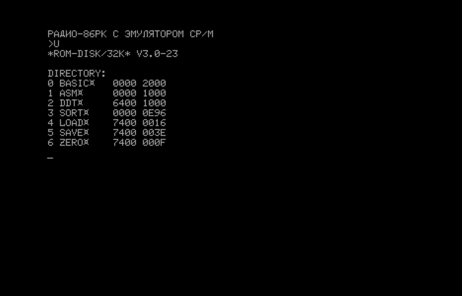

#  Программа управления ROM-диском

## Программа управления

Программа управление ROM-диском отличается от опубликованной и рассчитана на работу
с ROM-диском, совместимом по формату с Орион-128. При вызове директивы "U" или "R"
выводится содержимое ROM-диска.

Первый столбец содержит название клавиши для выбора файла. Второй - имя файла.
Третий и четвертый столбецы содержат адрес загрузки и размер файла, соответственно.

Выбор программы осуществляется клавишами от 0 до 9. После загрузки программы
производится ее запуск.

## Формат ROM-диска

ROM-диск может быть выполнен по одной из схем:
- [Радио 1987 год №3](http://archive.radio.ru/web/1987/03/)
- [Радио 1987 год №12](http://archive.radio.ru/web/1987/12/)
- [Радио 1991 год №10](http://archive.radio.ru/web/1991/10/)
- https://github.com/skiselev/radio-86rk-rom

!!!Тут вставить описалово формата ROM-диска. Не забываем, что есть "стандарт" Орион и "стандарт" МОНИТОРа с командой U.

Формат ROM-диска выбран таким образом, чтобы быть совместимым с Орион-128.
В адресах 0000H-07FFH раполагаются части эмулятора BDOS CP/M. Данная область условно
разделена на блоки по 128 байт, которые подгружаются в область обмена ОЗУ.

Блок 0 содержит код защиты от запуска на Орион-128 и код начальной инициализации
CP/M.

Блок 1 содержит код перехода на функции BDOS.

Блок 2 содержат функции CP/M BDOS.

Блоки 3-4 содержит код директив МОНИТОРа

Область 0800H-07DFFH содержит файлы в том же формате, что и диск ORDOS.

;0-7 - ИМЯ ФАЙЛА. МОЖЕТ СОДЕРЖАТЬ НЕ БОЛЕЕ 8 СИМВОЛОВ. ЕСЛИ ИМЯ СОДЕРЖИТ МЕНЬШЕ СИМВОЛОВ, СВОБОДНЫЕ ЯЧЕЙКИ ЗАПОЛНЯЮТСЯ ПРОБЕЛАМИ.
;8-9 - НАЧАЛЬНЫЙ АДРЕС РАЗМЕЩЕНИЯ ПРОГРАММЫ ПРИ СЧИТЫВАНИИ ЕЕ ИЗ ДИСКА В ОЗУ - АДРЕС "ПОСАДКИ".
;А-В - РАЗМЕР ФАЙЛА. В ЭТОТ ПАРАМЕТР ОГЛАВЛЕНИЕ ФАЙЛА(16 БАЙТ) НЕ ВХОДИТ.
;С - БАЙТ ФЛАГОВ. В "ORDOS" V2.X ИСПОЛЬЗУЕТСЯ ТОЛЬКО БИТ D7. СОСТОЯНИЕ "1" УКАЗЫВАЕТ НА ТО, ЧТО ФАЙЛ ЗАЩИЩЕН ОТ УНИЧТОЖЕНИЯ. ОСТАЛЬНЫЕ БИТЫ ЗАРЕЗЕРВИРОВАНЫ ДЛЯ РАСШИРЕНИЯ. ИЗМЕНЕНИЕ СОСТОЯНИЯ БИТА D7 ПРОИЗВОДЯТ ВНЕШНИЕ ЗАГРУЖАЕМЫЕ ДИРЕКТИВЫ ОПЕРАЦИОННОЙ СИСТЕМЫ.
;D-F - СЛУЖЕБНЫЕ ЯЧЕЙКИ СИСТЕМЫ.

TODO: Вставить описание формата файлов

Область 07E00H-07FFFH содержит программу управления ROM-диском по стандарту Радио-86РК.
