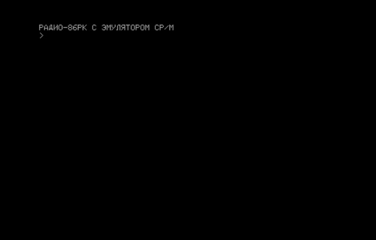
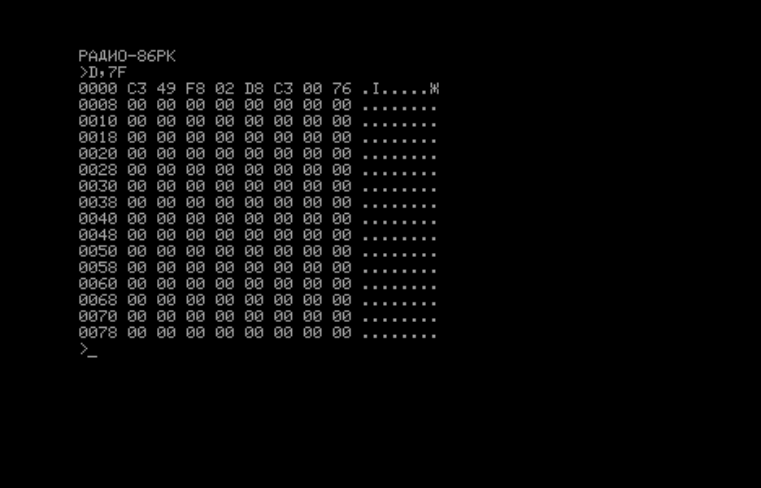
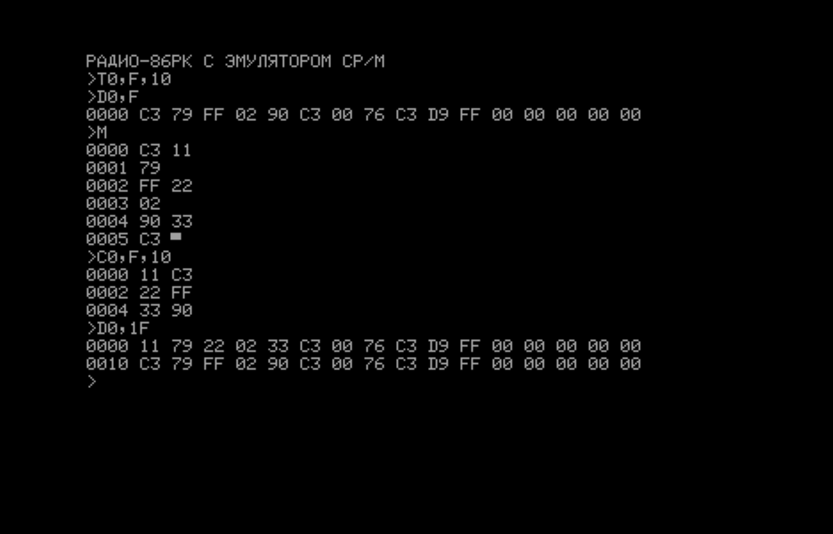
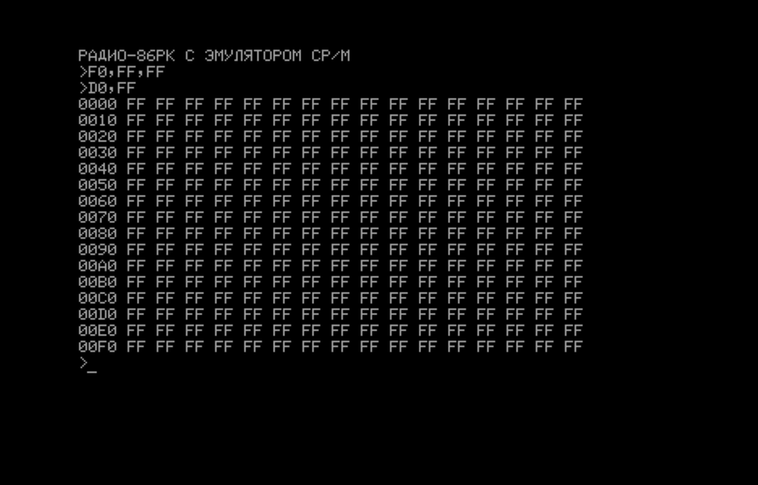
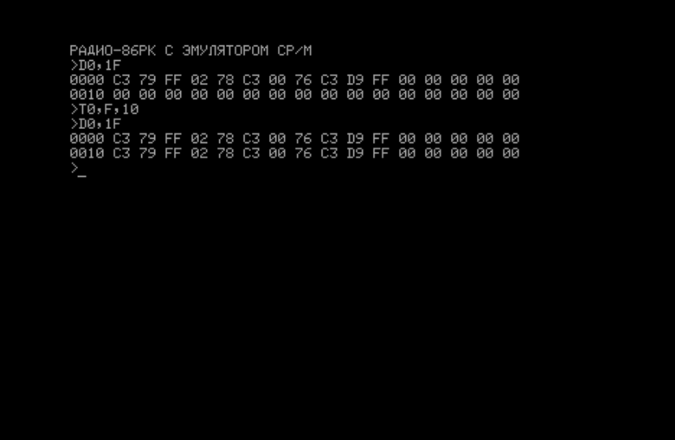
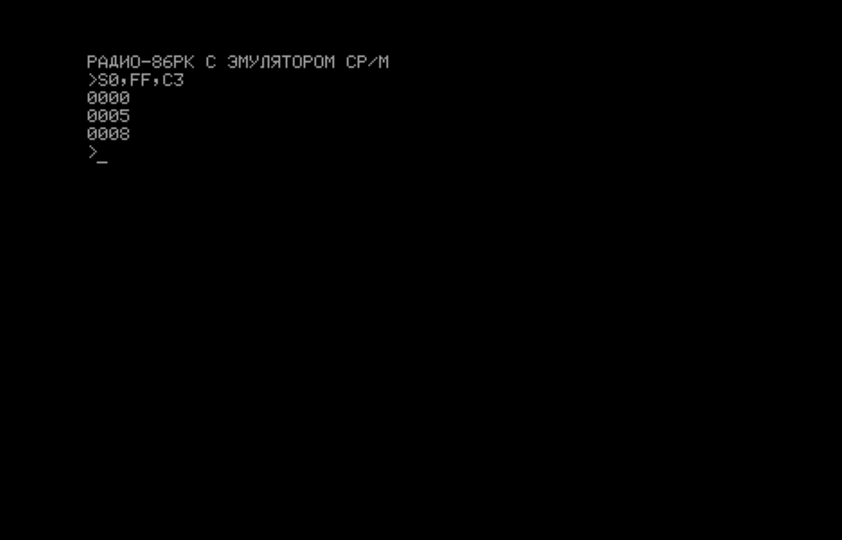
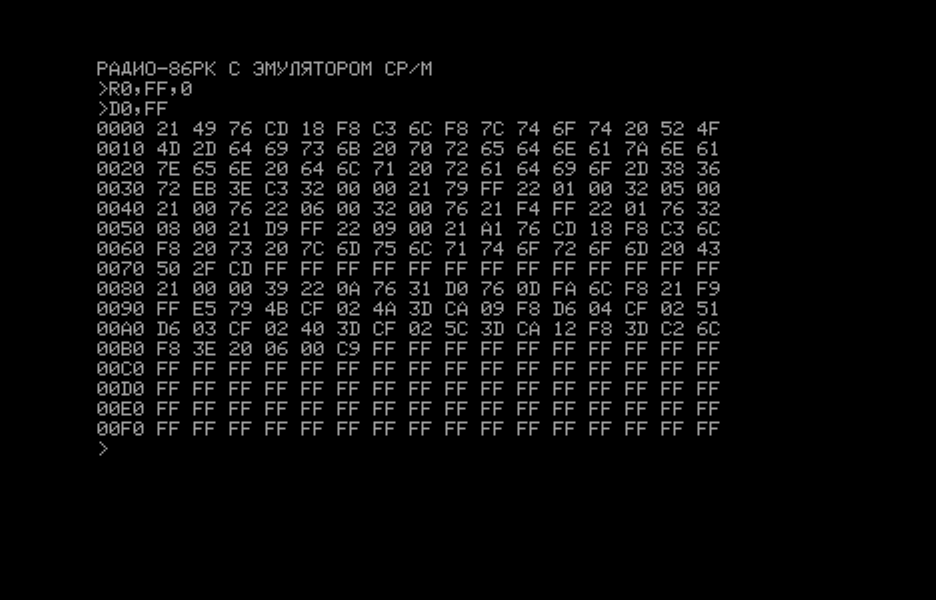

#  МОНИТОР для Радио-86РК для КР580, совместимый с Орион-128, поддержкой VT-52 и эмулятором CP/M

## ОБЩИЕ СВЕДЕНИЯ

Начало появления данного МОНИТОРа: https://ruecm.forum2x2.ru/t1112-topic
 
Звук только на INTE

В CCP принудительно включается ЛАТ-регистр.
 
Удалена директива X. Директива G теперь не имеет второго параметра -
стоп точки. Зато теперь введён возврат из запуска по G по RET. И можно
передавать два параметра (второй и третий, они передаются в DE и BC).

Все (имеющие смысл) точки входа МОНИТОРа Орион-128.

Поддержка VT-52 с некоторыми расширениями GEOS/TOS.

Поддержка (имеющих смысл) вызовов CP/M 2.

## ОБЗОР ВЕРСИЙ МОНИТОРов

Для "Радио-86РК" существует несколько МОНИТОРов, в той или иной степени
совместимых между собой. Базовая версия МОНИТОРа опубликована в журнале [Радио 1986 год	№8 и №9](http://archive.radio.ru/web/1986/08/).
Назовем его МОНИТОР-1.00. Он существет в двух вариантах 16Кб и 32Кб.

Позже были предложены модифицированные версии МОНИТОРов в журнале Радио.
Все они имеют отличия в основном только в интерактивной части. Назовем их МОНИТОР-1.0x

- МОНИТОР-1.01 под видеоконтроллер на рассыпухе [Радио 1987 год №5 и №6](http://archive.radio.ru/web/1987/05/)
- МОНИТОР-1.02 с поддержкой печати [Радио 1989 год №5, Радио 1989 год №11](http://archive.radio.ru/web/1989/05/)
- МОНИТОР-1.03 с ROM-диск и директивой U (взамен X) [Радио 1991 год №10](http://archive.radio.ru/web/1991/10/)
- МОНИТОР-1.04 с клавиатурой МС7007 [Радио 1991 год №12](http://archive.radio.ru/web/1991/12/)
- МОНИТОР-1.05 с директивой W (поиск слов) [Радио 1997 год №3](http://archive.radio.ru/web/1997/03/)

- МОНИТОР-М/80К для "Микро-80", совместимый с "Радио-86РК" [Радио 1989 год №11](http://archive.radio.ru/web/1989/11/)
- МОНИТОР-? для  "Микроша", совместимый с "Радио-86РК"

Данный МОНИТОР является оптимизированной и расширенной версией оригинального МОНИТОРа,
включающего в себя поддержку VT-52 и ряда расширений, включая совместимость
по стандартным точкам входа с МОНИТОР-2 "Орион-128" с некоторыми исключениями,
а также эмулятор CP/M. Также данный МОНИТОР включает в себя некоторые (или все)
функции вышеуказанных МОНИТОРов.

Данный МОНИТОР представлен несколькими вариантами, расчитанными под разный набор
аппаратного обеспечения "Радио-86РК". От минимальной конфигурации с ОЗУ 16кб,
до Радио86-РК с 32Кб, ROM-диском и РК-НГМД.

МОНИТОР-1.20 включает в себя максимум функций, которые удалось уместить в
оригинальный размер ПЗУ в 2кб.

МОНИТОР-2.00 включает в себя функционал МОНИТОР-1.20 и плюс все возможности
вышеуказанных МОНИТОРов. Кроме того, эмуляция CP/M в нем эмулирует многие
дисковые функции. Для своей работы МОНИТОР-2.00 требует наличие ROM-диска.

Каждая версия МОНИТОРа сфомирована под различное оборудование. Ряд функций
отличается в зависимости от аппаратуры. Особенно это связано с конфликтами
на уровне аппаратных решений.

Основная цель МОНИТОРа-1.20 - максимум функций в 2кб в минимальной конфигурации.
Основная цель МОНИТОРа-2.00 - максимум функций с использованием ROM-диска.

## ВВОД ДИРЕКТИВ И АНАЛИЗ РЕЗУЛЬТАТОВ

После запуска МОНИТОРа экран очищается, в левом верхнем углу
появляется надпись "РАДИО-86РК" или "РАДИО-86РК С ЭМУЛЯТОРОМ CP/M",
а под ней - стрелка >, уведомляющая пользователя о том, что МОНИТОР
готов к вводу очередной директивы.



Неверно набранные символы стирают нажатием на клавишу "ЗБ" ("Забой").
"<-" ("Курсор влево"), в отличие от оригинального МОНИТОРа, просто
смещает курсор влево. Для выполнения директивы нажимают на клавишу
возврата каретки "ВК". Если директива задана правильно, то начнется ее
выполнение, если нет, - на экране появится знак вопроса - признак того,
что МОНИТОР "не понимает" вашу директиву или произошло переполнение буфера
ввода.

 Таблица 1
```
ДИРЕКТИВЫ МОНИТОРА
ДИРЕКТИВЫ РАБОТЫ С ПАМЯТЬЮ
D <НАЧАЛЬНЫЙ АДРЕС>,/<КОНЕЧНЫЙ АДРЕC>/
L <НАЧАЛЬНЫЙ АДРЕС>,/<КОНЕЧНЫЙ АДРЕС>/
F <НАЧАЛЬНЫЙ АДРЕС>, <КОНЕЧНЫЙ АДРЕС>, <ЗАПИСЫВАЕМЫЙ КОД>
M <АДРЕС>
T <НАЧАЛЬНЫЙ АДРЕС>, <КОНЕЧНЫЙ АДРЕС>, <АДРЕС ОБЛАСТИ ПЕРЕСЫЛКИ>
C <НАЧАЛЬНЫЙ АДРЕС>, <КОНЕЧНЫЙ АДРЕС>, <АДРЕС ОБЛАСТИ СРАВНЕНИЯ>
S <НАЧАЛЬНЫЙ АДРЕC>, <КОНЕЧНЫЙ АДРЕС>, <ИСКОМЫЙ КОД>
ДИРЕКТИВЫ ЗАПУСКА И ОТЛАДКИ
G <АДРЕС ЗАПУСКА>
ДИРЕКТИВЫ ВВОДА-ВЫВОДА
O <НАЧАЛЬНЫЙ АДРЕС>,<КОНЕЧНЫЙ АДРЕС>,/<СКОРОСТЬ>/
I /<СМЕЩЕНИЕ>/,/< СКОРОСТЬ>/
ДОПОЛНИТЕЛЬНЫЕ ДИРЕКТИВЫ
R <НАЧАЛЬНЫИ АДРЕС ПЗУ>, <КОНЕЧНЫИ АДРЕС ПЗУ>, <АДРЕС ЗАГРУЗКИ>
(НАКЛОННЫМИ ЧЕРТАМИ ВЫДЕЛЕНЫ НЕОБЯЗАТЕЛЬНЫЕ ПАРАМЕТРЫ)
U
Z
```
 
Выполнение директив D, L, S, M может быть прервано. Для этого, удерживая
клавишу "УС", надо нажать еще и на "С"; выполнение директивы прервется,
и МОНИТОР будет готов выполнять следующую (здесь и далее для директив
используется латинский регистр).
 
Имена всех директив состоят из одной латинской буквы, непосредственно за
которой могут следовать не более трех параметров, представляющих собой
шестнадцатеричные числа. Один параметр от другого отделяют запятой или
пробелом. Их ставят и в тех случаях, когда один из параметров (в том
числе и первый) отсутствует.
 
## ДИРЕКТИВЫ РАБОТЫ С ПАМЯТЬЮ

Содержимое области памяти может быть выведено на экран дисплея в
виде шестнадцатеричных чисел и в виде алфавитно-
цифровых символов, соответствующих этим кодам ((директивы D и L). Если
при выполнении встретятся коды, не соответствующие ни одному
алфавитно-цифровому символу, то они отобразятся в виде точек. Содержимое
памяти выводится в виде таблицы из 8 колонок. Слева от каждой строки
указывается шестнадцатеричный адрес первой в строке ячейки. 



Форматы этих и других директив приведены в табл. 1. Директива М предназначена
для просмотра и изменения содержимого одной или нескольких ячеек памяти.
После ее ввода на экране высвечивается адрес ячейки и ее содержимое,
курсор останавливается справа от этого значения, и МОНИТОР "ожидает"
ввода с клавиатуры. Если необходимо изменить содержимое ячейки, набирают
новое значение и нажимают клавишу "ВК", если изменений не требуется, ее
нажимают сразу же. При каждом нажатии на клавишу "ВК" значение адреса
автоматически увеличивается на единицу. Выполнение директивы продолжается
до тех пор, пока не будет вводен с клавиатуры код "УС" + "С".


 
Если во все ячейки области памяти необходимо записать одинаковые коды,
удобно воспользоваться директивой F.



Директива T предназначена для копирования (пересылки) содержимого одной
области памяти в другую. Копирование осуществляется побайтно, начиная с
младшего адреса.


 
Для сравнения двух областей памяти необходимо пользоваться директивой C.
Если содержимое соответствующих ячеек памяти не совпадает, на экран
выводится адрес ячейки из первой области, ее содержимое и содержимое
соответствующей ячейки из второй области.


МОНИТОР предоставляет
пользователю возможность поиска кода в заданной области памяти
(директива S). При обнаружении искомого кода на экране появляются
адреса ячеек, в которых он был обнаружен.


 
## ДИРЕКТИВЫ ЗАПУСКА

Для запуска программы служит директива G.

Для запуска программы с адреса 075FDh/035FDH служит директива Z.
Эта директива введена для удобства работы с программами, которые
размещаются под “потолком” ОЗУ пользователя, т. е. в верхних
адресах памяти. В таких программах (в конце) по адресу 075FDH/035FDH
должна находиться команда безусловного перехода (JMP) на начало программы.
При этом размер программы не будет влиять на стартовый адрес, а значит,
все подобные программы можно запускать по одному стандартному адресу — 075FDH/035FDH.
 
## ДИРЕКТИВЫ ВВОДА-ВЫВОДА

Первые два параметра директивы вывода на магнитную ленту О задают
область памяти, содержимое которой подлежит выводу, третий -
шестнадцатеричный код, определяющий скорость вывода. Если скорость
не указать, то будет использовано либо значение, заданное в предыдущей
директиве вывода, либо стандартное - 1DH (около 1200 бит/с), записываемое
(при нажатии на кнопку "СБРОС") в рабочую ячейку МОНИТОРа (07630Н/03630Н)
(использовать константу вывода менее 10H недопустимо!). Рекомендуем
пользоваться стандартной скоростью, так как она выбрана с учетом
использования магнитофона и магнитной ленты невысокого качества.
Кроме того, стандартная скорость облегчит обмен программами. После
завершения вывода, на экране отобразятся начальный и конечный адреса
и четырехзначная контрольная сумма выведенной информации.

Ввод с ленты осуществляется по директиве I, которая может иметь два
параметра. Первым параметром - необязательным - задают смещение. Если
он есть, вводимая информация будет загружена по адресу, являющемуся
суммой указанного в записи на ленте адреса и смещения. Второй параметр
определяет временную задержку при чтении с ленты. Он также может
отсутствовать, но в этом случае будет взята задержка, использовавшаяся
в предыдущей команде ввода (если вы не нажимали на кнопку "СБРОС") или
установленная (по умолчанию) при начальной настройке рабочих ячеек
МОНИТОРа (стандартное значение, записанной по адресу 0762FH/0362FH - 2АН).
 
После окончания ввода МОНИТОР сообщит начальный и конечный адреса
загрузки и контрольную сумму, подсчитанную при вводе информации.
Если она не совпадет с введенной с ленты, то на следующей строке
будет выведено значение, записанное на ленте. Этот факт
свидетельствует об ошибках при чтении информации с ленты.
 
Прервать программу ввода с магнитной ленты можно либо выключением
магнитофона, либо вводом с клавиатуры кода "УС" + "С".
 
Используемый в РК формат записи на магнитную ленту отличается от
используемого в "Микро-80" только наличием в конце выводимой
информации контрольной суммы, поэтому программы, записанные с
"Радио-86РК", могут быть введены в "Микро-80". При попытке
ввести в РК программу, записанную с "Микро-80", подпрограмма
ввода будет ожидать ввода контрольной суммы. Если не останавливать
магнитофон и позволить ей читать начало следующей программы, то
она будет воспринята как контрольная сумма и ввод будет окончен.
Естественно, что такая "контрольная сумма" не совпадет с реальной,
и МОНИТОР ответит на эти действия вопросительным знаком,
 
При наличии ROM-диска можно использовать директивы R и U.

Директива R - чтение информации из ПЗУ, подключаемого к ППА D14.



Директива U - запуск программы управления ROM-диском

Директива U вызывает программу управления ROM-диском. Данная директива реализована
совместимо с [Радио 1991 год №10]((http://archive.radio.ru/web/1991/10/)).

- [Руководство пользователя по программе управление ROM-диском](ROMCTRL.md)
